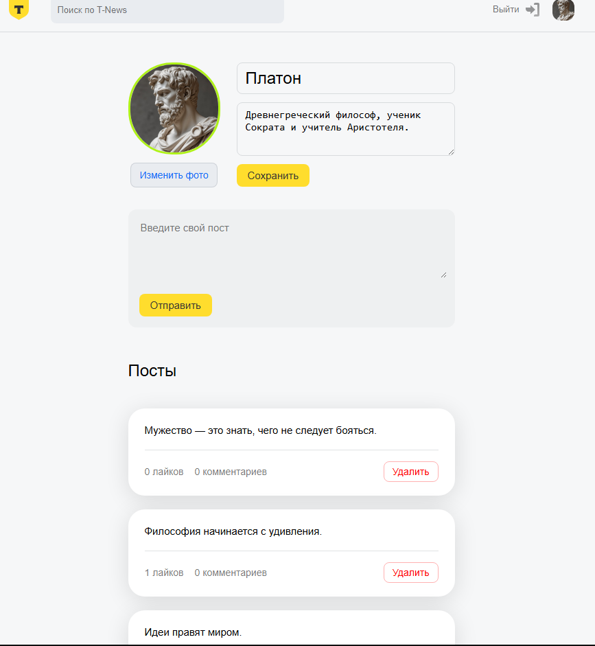
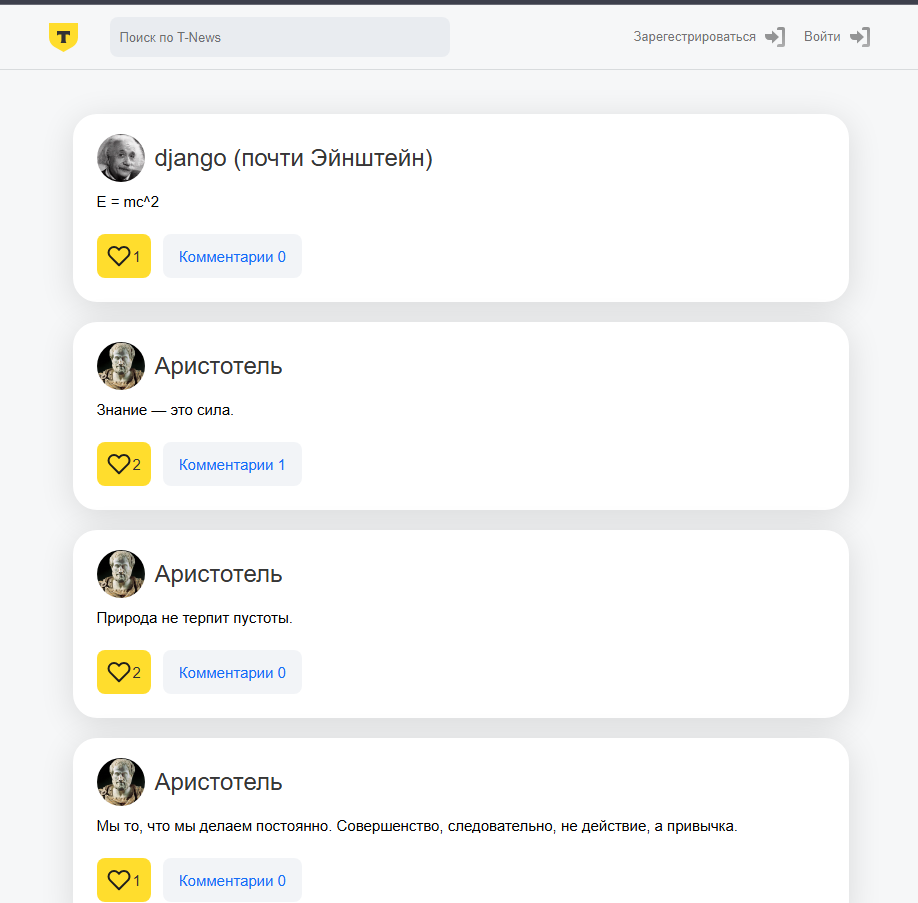
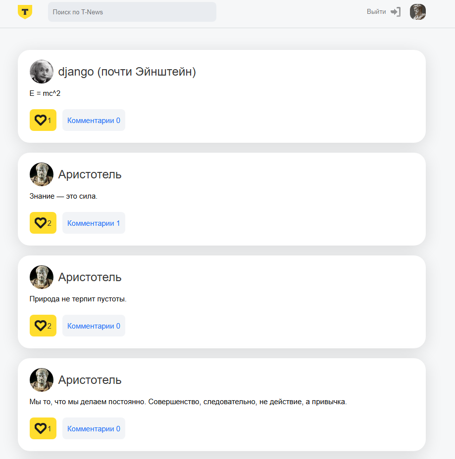
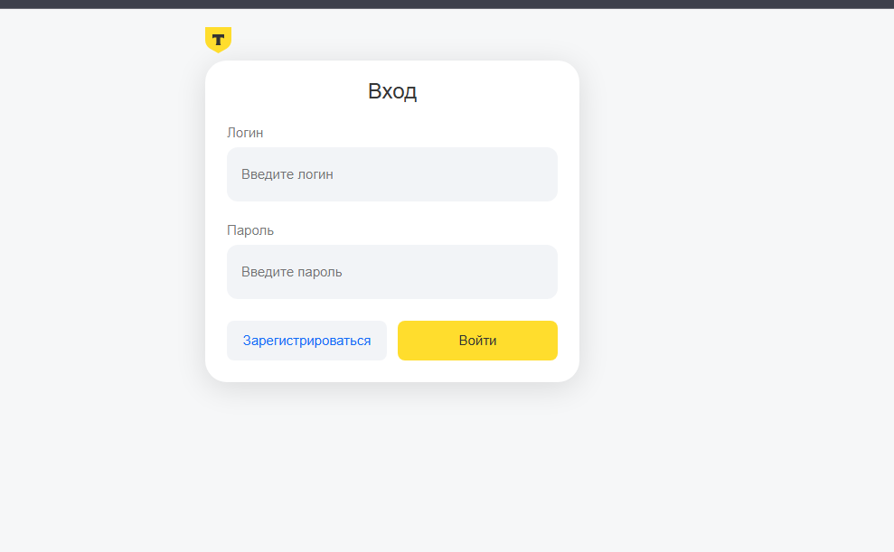
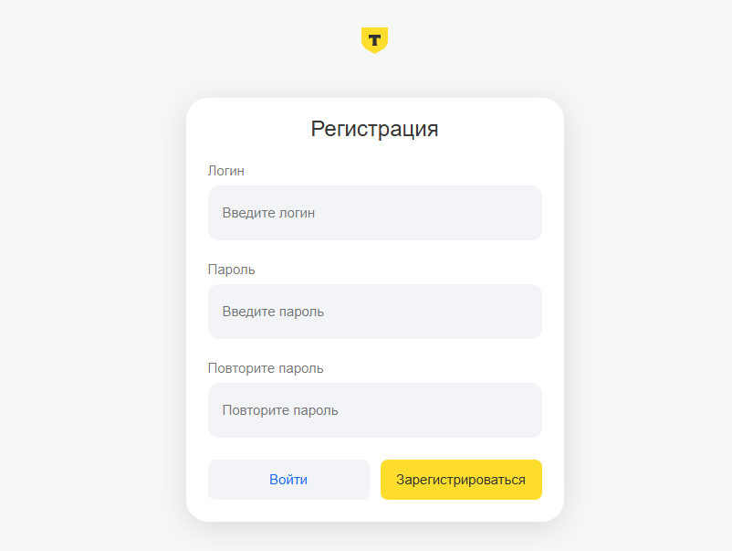
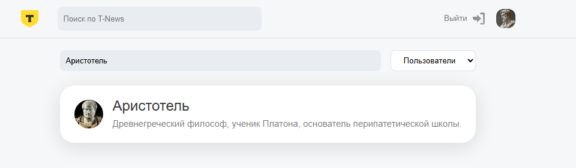
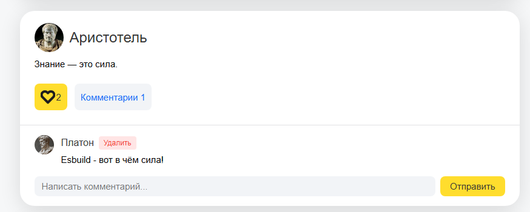
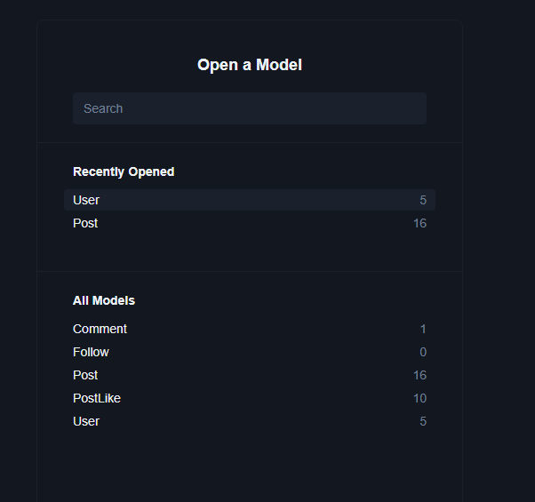

# 🎓 Итоговый проект - T-News

### Всего 5 основных страниц:

Главная страница (Лента): Основная страница, где отображаются посты всех подписанных пользователей. К каждому посту можно поставить лайк и комментарий, можно отобразить тред с комментариями по клику на кнопку "Комментарии (5)". Комментарии являются плоским списком, только автор комментария может его удалить.

Страница профиля пользователя:
* Информация о пользователе (аватар, имя, биография).
* Кнопка подписаться/отписаться.
* Текстовое окно для создания нового поста (если это твой профиль) и кнопка опубликовать.
* Список постов пользователя аналогичный главной странице. Только автор может удалить свой пост.

Страница входа/регистрации.

Страница поиска: позволяет искать пользователей и посты (тумблер по чему ищем). 

Настройки аккаунта: для изменения профиля и настроек пользователя (аватар, имя, биография, подписки).

### Макет 
https://www.figma.com/design/Qg8G56Dkfc2CIzlUyho6Fs/T-News-students?node-id=0-1&t=wzRavexM4tVd7xsP-1

### Итоговый результат

#### Страница профиля

#### Главная страница (без авторизации)

#### Главная страница (с авторизацией)

#### Страница входа

#### Страница регистрации

#### Страница поиска

#### Комментарии

#### Prisma Studio

### API
Файл с описанием API находится по пути: `openapi.yaml`
